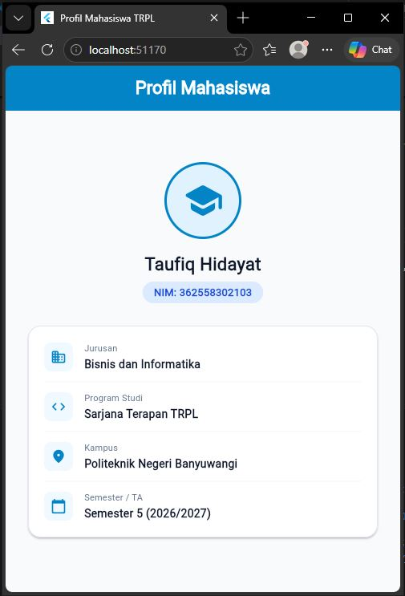
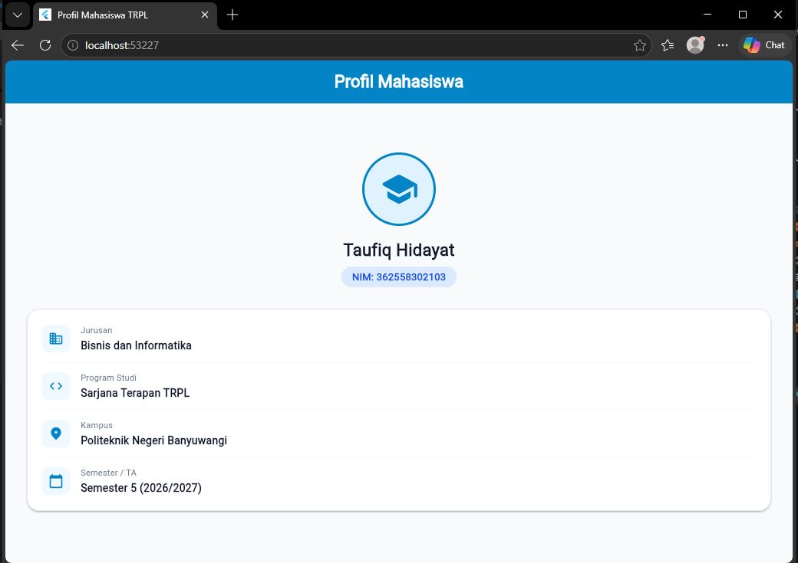

# Laporan Praktikum Modul 01: Mobile Ecosystem, Flutter Setup & Profile App

- **Nama**: TAUFIQ HIDAYAT
- **NIM**: 362558302103
- **Kelas / Prodi**: 2C / Sarjana Terapan TRPL
- **Mata Kuliah**: Pemrograman Perangkat Bergerak (Semester 3)

---

## 1. Ringkasan Aktivitas
pada minggu ini saya memahami bahwa flutter tidak bisa bikin componen di halaman yang sama makanya flutter pakai parent, child, children, dan kita sebagai pengembang harus tau layernya.
## 2. Bukti Tangkapan Layar (Running App)
[Sertakan minimal 2 screenshot bukti aplikasi profil berjalan di emulator atau HP fisik Anda]

## 3. Kendala yang Dihadapi & Solusinya
- **Kendala**: Perintah `flutter` tidak dikenali di terminal (`'flutter' is not recognized as an internal or external command`) saat pertama kali setup di Windows. Selain itu, terjadi kendala saat build/deteksi Android toolchain akibat konfigurasi path Java/JDK dan Android SDK yang belum terdaftar secara tepat di Environment Variables sistem.
- **Solusi**: 
  1. Menambahkan path folder `bin` dari Flutter SDK (contoh: `C:\src\flutter\bin`) ke dalam `Path` pada User/System Environment Variables Windows, lalu melakukan restart pada terminal/editor VS Code.
  2. Mengonfigurasi direktori JDK yang sesuai menggunakan perintah `flutter config --jdk-dir` serta melengkapi paket *Android SDK Command-line Tools (latest)* melalui SDK Manager dan menyetujui lisensi via `flutter doctor --android-licenses`.

## 4. Jawaban Pertanyaan Refleksi
1. **Pilihan Native vs Flutter**: 
   Pilihan antara Native (Kotlin/Swift) dan Flutter bergantung pada kebutuhan proyek, batas waktu, dan kompleksitas fitur. 
   - **Flutter** menjadi pilihan tepat untuk proyek yang membutuhkan pengembangan cepat (*rapid development*) dengan rilis multi-platform (Android & iOS) secara simultan menggunakan satu basis kode (*single codebase*), tampilan UI yang konsisten di berbagai perangkat, serta efisiensi anggaran/tim.
   - **Native** lebih diutamakan jika aplikasi sangat bergantung pada fitur perangkat keras spesifik/terbaru, integrasi API level rendah (seperti pemrosesan video berat, modul Bluetooth/IoT kompleks), atau aplikasi yang menuntut performa komputasi grafis dan memori paling optimal tanpa lapisan abstraksi tambahan.

2. **Prinsip UI = f(state)**: 
   Prinsip `UI = f(state)` menyatakan bahwa antarmuka pengguna (UI) adalah representasi visual murni dari fungsi (*function*) terhadap kondisi data/keadaan saat ini (*state*). Dalam pemrograman deklaratif seperti Flutter, developer tidak memanipulasi elemen UI secara manual atau imperatif (misal: *setText* atau *showHide*). Sebaliknya, developer cukup mengubah nilai atau kondisi *state*, dan framework secara otomatis akan me-render ulang (*re-build*) tampilan UI yang relevan agar sesuai dengan data terbaru tersebut.

3. **Pentingnya Conventional Commits**: 
   Penerapan *Conventional Commits* (seperti `feat:`, `fix:`, `docs:`, `chore:`) penting dalam kolaborasi perangkat lunak karena:
   - **Keterbacaan Riwayat (Git History)**: Memberikan struktur pesan komit yang jelas, konsisten, dan mudah dipahami oleh anggota tim lain mengenai maksud perubahan kode.
   - **Otomasi Rilis & Changelog**: Memungkinkan *pipeline* CI/CD untuk menghasilkan berkas rilis (*semantic versioning* / changelog) secara otomatis berdasarkan riwayat komit.
   - **Memudahkan Penelusuran Bug**: Membantu proses *code review* dan pelacakan (*bisecting*) ketika terjadi regresi atau *bug* pada versi aplikasi tertentu.