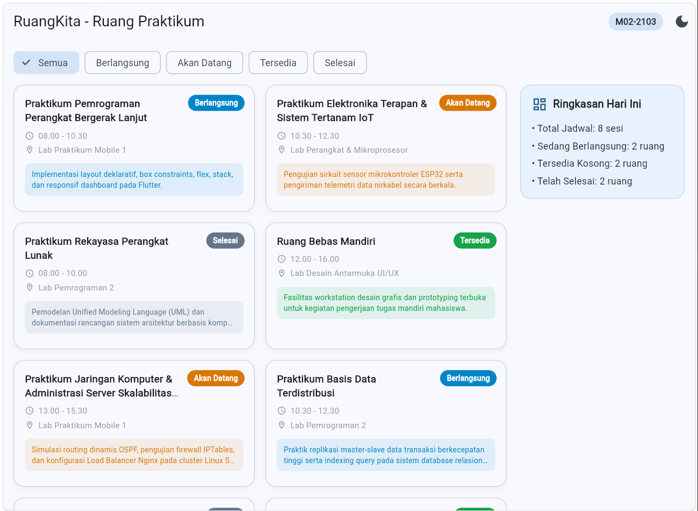
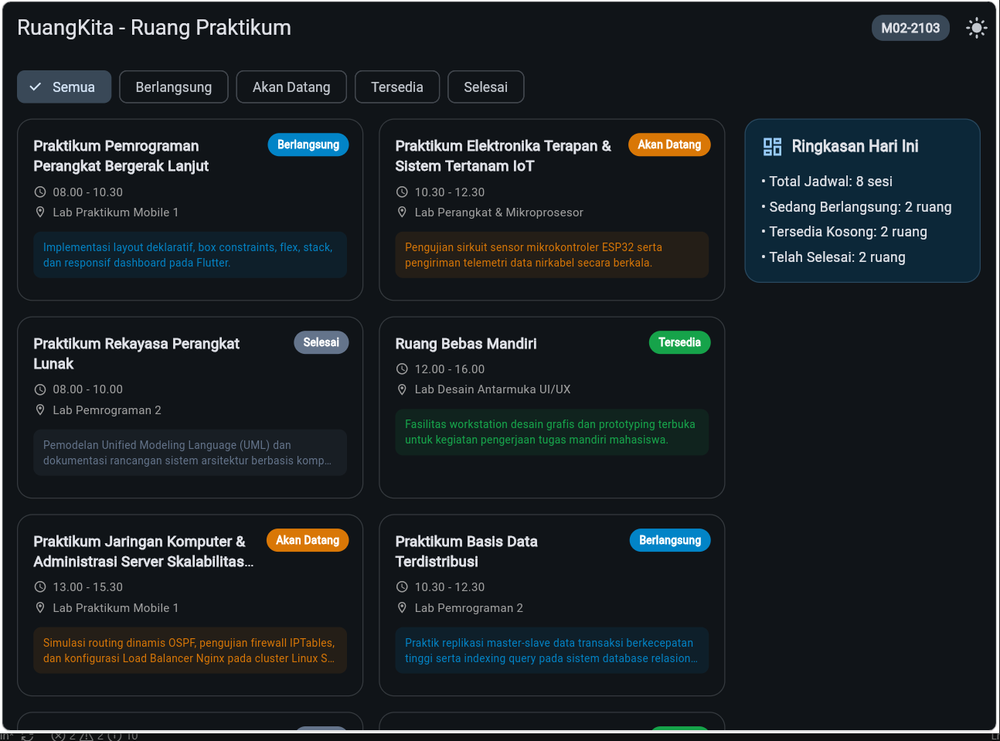
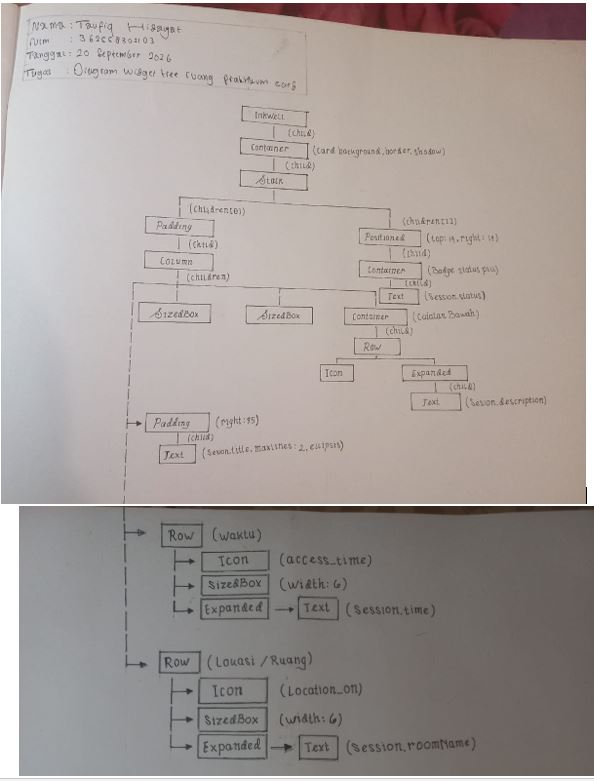

# Tugas Rumah Modul 02: Declarative UI & Responsive Layout
**Studi Kasus**: RuangKita - Dashboard Ketersediaan Ruang Praktikum  
**Mata Kuliah**: Pemrograman Perangkat Bergerak  

---

## 1. Identitas Mahasiswa & Domain
- **Nama**: Taufiq Hidayat
- **NIM**: (Tulis NIM Lengkap Anda)
- **Digit Terakhir NIM**: 3
- **Domain Aplikasi**: Ruang Praktikum (Praktikum pemrograman, elektronika, desain)
- **Kode Identitas UI Wajib**: `M02-2103`
---

## 2. Ringkasan Arsitektur Widget & Penggunaan State
Aplikasi ini dibangun menggunakan arsitektur antarmuka deklaratif berbasis Flutter Material 3:
- **`StatefulWidget`**: Digunakan pada halaman utama `RuangPraktikumPage` dan root `MyApp` untuk mengelola local state secara reaktif:
  - Mengelola pilihan filter kategori sesi praktikum (`_selectedFilter`) melalui interaksi `ChoiceChip`.
  - Mengelola peralihan tema visual (*Light/Dark Mode*) secara langsung melalui pemanggilan `setState()`.
- **`LayoutBuilder`**: Bertindak sebagai pembatas dan penentu keputusan hierarki layout lokal berdasarkan `constraints.maxWidth`.
- **`Stack` & `Positioned`**: Digunakan pada kartu sesi praktikum untuk meletakkan badge status (*Berlangsung*, *Akan Datang*, *Tersedia*, *Selesai*) sebagai layer overlay di pojok kanan atas tanpa mengganggu aliran baris vertikal teks.
- **`Flex` (`Row` & `Column`)**: Mengorganisasi elemen teks, ikon detail waktu, dan nama ruangan, dengan penempatan `Expanded` dan `TextOverflow.ellipsis` guna menjamin ketahanan dari error *RenderFlex overflow*.

---

## 3. Tabel Breakpoint Responsif
Implementasi layout adaptif mengacu pada tiga kelas lebar (breakpoint):

| Viewport | Rentang Lebar (dp) | Layout yang Digunakan | Alasan & Keputusan Teknis |
| :--- | :--- | :--- | :--- |
| **Compact** | `< 600 dp` | `Column` vertikal (1 kolom) | Menjaga kepadatan konten pada layar ponsel agar teks dapat dibaca nyaman tanpa terpotong secara horizontal. |
| **Medium** | `600 - 839 dp` | `GridView.builder` (2 kolom, childAspectRatio 1.85) | Memanfaatkan ruang layar tablet agar kartu tidak terlalu memanjang secara vertikal dan menjaga proporsi visual. |
| **Expanded** | `≥ 840 dp` | `Row` (Grid 2 kolom flex: 3 + Panel Ringkasan flex: 1) | Mencegah kartu melar berlebihan (*stretched*) pada layar monitor/desktop dengan memanfaatkan sisa ruang sisi kanan untuk ringkasan metrik jadwal harian. |

---

## 4. Bukti Running Antarmuka (Screenshots)
Seluruh screenshot berikut menampilkan label identitas wajib **M02-2103** di sisi kanan atas *AppBar*.

### 1. Mobile Portrait (Light Mode - 360 x 800)

### 2. Tablet (Medium 2 Kolom - 720 x 1024)

### 3. Expanded (Wide 2 Kolom + Panel Ringkasan - 1024 x 800)

### 4. Dark Mode

---

## 5. Bukti Diagram Widget Tree (Tulisan Tangan)
Foto diagram silsilah widget tree untuk satu kartu utama yang digambar di atas kertas fisik dengan identitas tulisan tangan:

---

## 6. Jawaban Refleksi Teknis

### Mengapa `Expanded` membantu `Text` di dalam `Row`?
Secara bawaan (*default*), widget `Row` memberikan batas lebar tak terhingga (*unconstrained width*) ke arah horizontal kepada anak-anaknya (*children*). Jika widget `Text` memiliki string karakter yang panjang melebihi sisa lebar layar, teks akan terus memanjang ke kanan dan memicu galat visual garis kuning-hitam (*RenderFlex overflowed*). Dengan membungkus `Text` menggunakan `Expanded`, `Row` memaksa widget tersebut tunduk pada ruang sisa yang tersedia (*bounded constraint*), sehingga parameter `maxLines` dan `TextOverflow.ellipsis` dapat memotong teks secara rapi.

### Mengapa `LayoutBuilder` lebih tepat untuk layout lokal dibanding hanya `MediaQuery`?
`MediaQuery.of(context).size.width` selalu mengukur dimensi total jendela aplikasi atau seluruh layar perangkat. Hal ini kurang tepat jika widget tersebut berada di dalam komponen bersarang (*nested components*), seperti di dalam panel samping, dialog, split screen, atau tablet master-detail. Sebaliknya, `LayoutBuilder` memberikan parameter `BoxConstraints` dari *parent* langsungnya (`constraints.maxWidth`). Hal ini memungkinkan komponen kartu atau sub-antarmuka bersifat modular dan responsif terhadap area wadah tempat ia diletakkan, bukan sekadar ukuran fisik layar HP.

### Apa yang berubah pada widget tree ketika `setState()` dipanggil?
Ketika `setState()` dipanggil, Flutter menandai elemen *StatefulWidget* tersebut sebagai kotor (*dirty*). Pada putaran frame berikutnya, fungsi `build()` milik State terkait akan dieksekusi ulang dari awal. Flutter kemudian merekonstruksi sub-pohon widget baru (*new widget tree*) dan membandingkannya (*diffing algorithm*) dengan pohon elemen yang ada di memori. Hanya bagian elemen dan render object yang mengalami perubahan konfigurasi (misalnya teks status baru, item filter yang aktif, atau skema warna tema) yang akan digambar ulang (*repainted*) di layar, menjaga performa tetap optimal tanpa me-restart aplikasi.